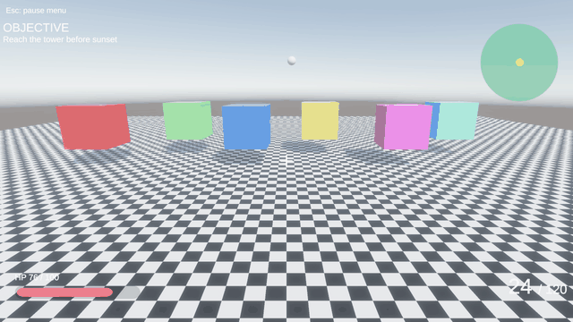
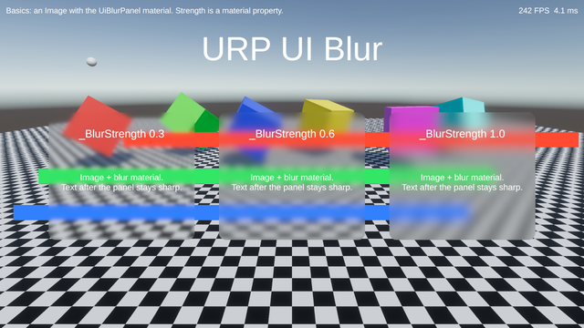
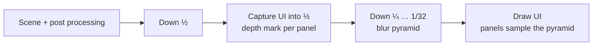
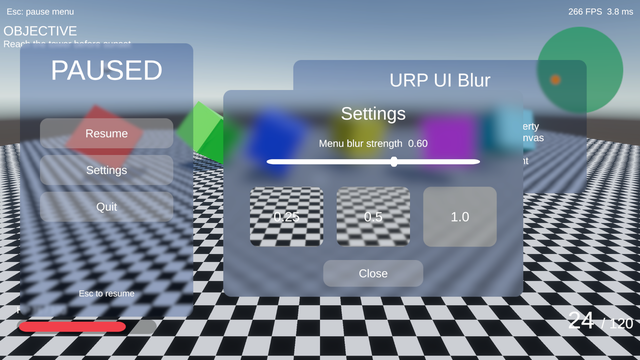
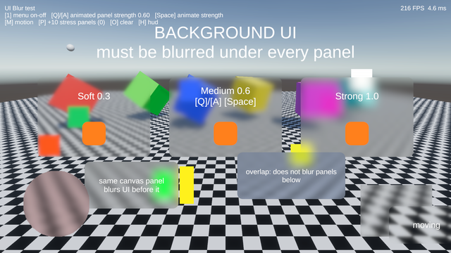

<div align="center">

# URP UI Blur

**Frosted glass for uGUI in URP, as a material.**
Put the blur material on an Image, set its strength, done. No components, no extra canvases, no sorting layers.

[](https://unity.com/releases/unity-6)
[](https://docs.unity3d.com/Packages/com.unity.render-pipelines.universal@17.3/manual/index.html)
[](https://github.com/RottenEagle1337/urp-ui-blur/tags)
[](LICENSE.md)



[Installation](#installation) · [Quick start](#quick-start) · [How it works](#how-it-works) · [Reference](#reference) ·
[Demo project](#demo-project) · [Roadmap](#roadmap)

</div>

In the spirit of HDRP refraction, where transparent materials sample a color pyramid:

- **The blur is a UI material.** Sprite alpha is the shape; `Sliced` sprites, stencil `Mask`, `RectMask2D`,
  `CanvasGroup` and tint through `Image.color` work as usual.
- **Strength is a material property** (`_BlurStrength`, 0..1, linear in blur radius). Use material instances for
  different strengths and animate them like any other material property.
- **The hierarchy of one canvas is the blur order.** A panel blurs the scene and the UI drawn before it; its
  children and everything after it stay sharp on top.
- **Cheap and predictable:** 6 render passes at 1080p whatever the number of panels, raster passes only,
  no per-frame allocations.

## Platforms

| Graphics API | Status |
|---|---|
| Direct3D 12, Windows Editor | ✅ developed and tested |
| Direct3D 11, Vulkan, Metal, OpenGL ES 3 | 🔜 verification planned — see [Roadmap](#roadmap) |

Only Screen Space Camera canvases are blurred; see [Limitations](#limitations).

## Installation

Requires Unity 6 (6000.3 or newer, URP 17.3+ with Render Graph; developed on 6000.6, EditMode tests pass on
6000.3, 6000.5 and 6000.6).

*Window > Package Manager > **+** > Install package from git URL...*

```
https://github.com/RottenEagle1337/urp-ui-blur.git#v2.0.0-preview.1
```

or add to `Packages/manifest.json`:

```json
"com.rotteneagle.urp-ui-blur": "https://github.com/RottenEagle1337/urp-ui-blur.git#v2.0.0-preview.1"
```

## Quick start

1. Add **Ui Blur Feature** to your URP Renderer Data and press **Remove UI layers from Transparent Layer Mask**
   in its inspector (the feature draws the UI itself, after post processing).
2. Set your canvas to **Screen Space - Camera** with the camera that uses this renderer.
3. **GameObject > UI > Blur Panel**, or set the material of any Image to
   `Packages/com.rotteneagle.urp-ui-blur/Runtime/Materials/UiBlurPanel.mat`.
4. Duplicate the material and change **Blur Strength** for softer or stronger panels.

```
Canvas (Screen Space - Camera)
├─ HUD                          ← blurred under the panels below
└─ Menu (CanvasGroup)
   ├─ Panel  (blur material, strength 0.6)
   │  └─ Text                   ← sharp, on top of the blur
   └─ Panel  (another material instance, strength 1.0)
```



## How it works



- **Pyramid.** Each level is a 5-tap Kawase downsample of the previous one. A panel picks the two levels around
  its strength and samples them with cubic B-spline filtering, so the radius changes continuously.
- **Capture.** The UI is drawn once more into the half resolution level with its own depth-stencil buffer. There
  blur panels write no color but a *nearest* depth mark in their shape, so UI drawn after a panel fails the depth
  test inside it. The pyramid therefore holds exactly what is under each panel. The capture shares one native
  render pass with the first downsample.
- **Draw.** All Screen Space Camera UI is drawn once more on the camera color, after post processing (so bloom
  and tonemapping do not touch it). Panels sample the pyramid with `SV_Position`, no platform specific UV flips.

At 1080p with the default 5 levels this is 6 render passes in the Frame Debugger; the capture costs one extra
UI draw at a quarter of the pixels.

## Reference

### Ui Blur Feature

<details>
<summary>Settings</summary>

| Setting | Default | Meaning |
|---|---|---|
| Max Blur Levels | 5 | Pyramid levels at the reference height; strength 1 has a radius of about 2^levels pixels. One render pass per level. |
| Reference Height | 1080 | Screen height the strength is authored for; the radius scales with the camera target height. |
| Ui Layer Mask | `UI` | Unity layers of the UI drawn by the feature. Remove them from the renderer Transparent Layer Mask. |
| Support Stencil Masks | on | Binds the camera depth-stencil while drawing UI (needed for `Mask`). |
| Blur Render Texture Cameras | off | Also build the pyramid for cameras that render into a RenderTexture (minimaps, portals). |
| Injection Point | After Rendering Post Processing | Where the UI is drawn. |

Scene View, Preview and Reflection cameras draw the UI without blur.

</details>

### Blur Panel material

| Property | Meaning |
|---|---|
| `_BlurStrength` | 0..1, blur radius ≈ `1 + strength × (2^levels − 1)` pixels at the reference height |
| `_Color` | Tint, multiplied with `Image.color` (a slightly dark cool tint reads as frosted glass) |

Every material instance is a separate UI batch; keep the number of distinct strengths small.

### Scripting

```csharp
using UnityEngine;
using UnityEngine.UI;

public class BlurFade : MonoBehaviour
{
    static readonly int BlurStrength = Shader.PropertyToID("_BlurStrength");

    [SerializeField] Image _panel;
    Material _material;

    void Awake()
    {
        _material = new Material(_panel.material);   // one runtime instance per group of panels
        _panel.material = _material;
    }

    void Update()
    {
        _material.SetFloat(BlurStrength, Mathf.PingPong(Time.time, 1f));
    }

    void OnDestroy() => Destroy(_material);
}
```

## Demo project

[urp-ui-blur-dev](https://github.com/RottenEagle1337/urp-ui-blur-dev) is the development Unity project with this package as
a submodule and three scenes:

| | Scene | Shows |
|---|---|---|
|  | **Showcase** | game HUD, pause menu and settings popup in one canvas; Esc fades the blur in and out |
|  | **Basics** | three panels with strength 0.3 / 0.6 / 1.0 over moving UI |
|  | **BlurTest** | test stand: overlapping panels, RectMask2D, stencil Mask, moving panels, stress test |

## Troubleshooting

<details>
<summary><b>The UI is drawn twice or looks post processed</b></summary>

The `UI` layer is still in the renderer **Transparent Layer Mask**. The feature inspector shows a warning and a
button that removes it.

</details>

<details>
<summary><b>A panel is black</b></summary>

The panel is not drawn by the feature: the canvas is Screen Space Overlay, the camera renders into a RenderTexture
(enable **Blur Render Texture Cameras**), it is the Scene View, or the renderer has no Ui Blur Feature.

</details>

<details>
<summary><b>A bright element next to a panel bleeds into its edge</b></summary>

The depth mark covers the panel shape only. UI drawn *after* a panel but *outside* it is part of the captured
image and can leak into the panel edge up to the blur radius. Make such elements children of the panel, or move
them before it in the hierarchy.

</details>

<details>
<summary><b>UI with a custom shader is not hidden under a panel</b></summary>

Custom UI shaders must keep `ZTest [unity_GUIZTestMode]` (or `LEqual`) so the capture depth test can reject them.

</details>

<details>
<summary><b>Stencil masks do not work, or a warning about MSAA</b></summary>

With MSAA and Post Processing off, the camera color is still multisampled when the feature runs: the UI is drawn
without blur and a warning is logged. Enable Post Processing on the camera or disable MSAA.

</details>

## Limitations

- Screen Space Camera canvases only. Screen Space Overlay canvases are drawn by URP after the camera; they are
  fine for a HUD that must stay sharp on top of everything.
- The UI drawn by the feature ignores scene depth: it is always on top of the scene.
- Panels do not blur each other.
- The UI is drawn twice (once at half resolution for the capture), so UI draw calls on the CPU double.

## Roadmap

- [x] **2.0.0-preview.1**: material blur with per-material strength, hierarchy capture, Windows / Direct3D 12,
  EditMode tests on 6000.3, 6000.5 and 6000.6.
- [ ] **2.0.0-preview.2 — verification**: Direct3D 11, Vulkan, Android (Vulkan, OpenGL ES 3), IL2CPP player.
- [ ] **2.0.0-preview.3 — edge quality**: expand the capture mark by the blur radius to remove the halo of later UI.
- [ ] **2.0.0**: verified platforms, minimum Unity version confirmed on the latest LTS.

## Related repositories

| Repository | Contents |
|---|---|
| **urp-ui-blur** | this package |
| [urp-ui-blur-dev](https://github.com/RottenEagle1337/urp-ui-blur-dev) | development Unity project: Showcase, Basics and BlurTest scenes, README capture tools, the package as a submodule |

## Credits and license

Released into the public domain under the [Unlicense](LICENSE.md). The idea of a global blur texture sampled by
a UI material comes from [Unified Universal Blur](https://github.com/lukakldiashvili/Unified-Universal-Blur) by
Luka Kldiashvili (MIT); no code is taken from it.
